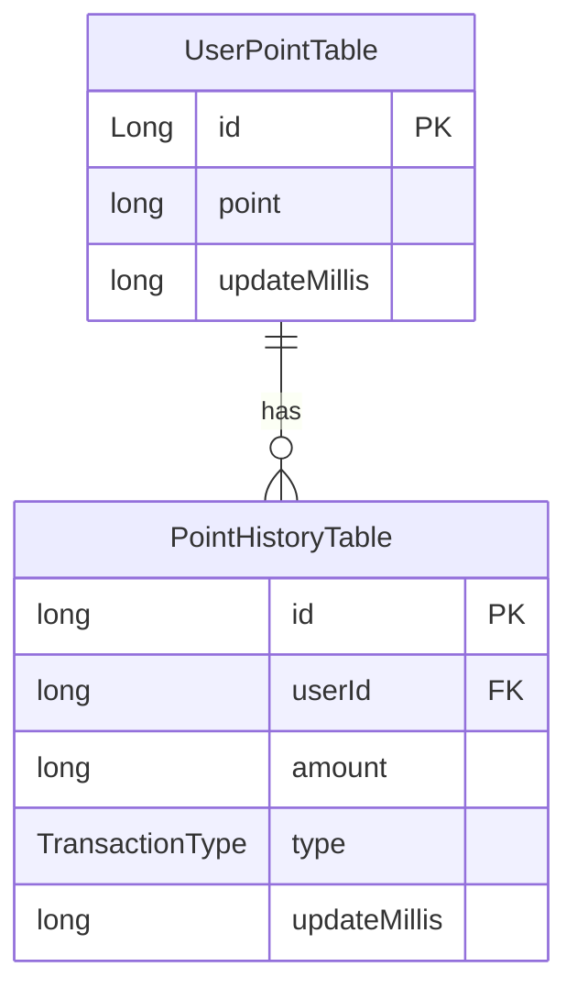
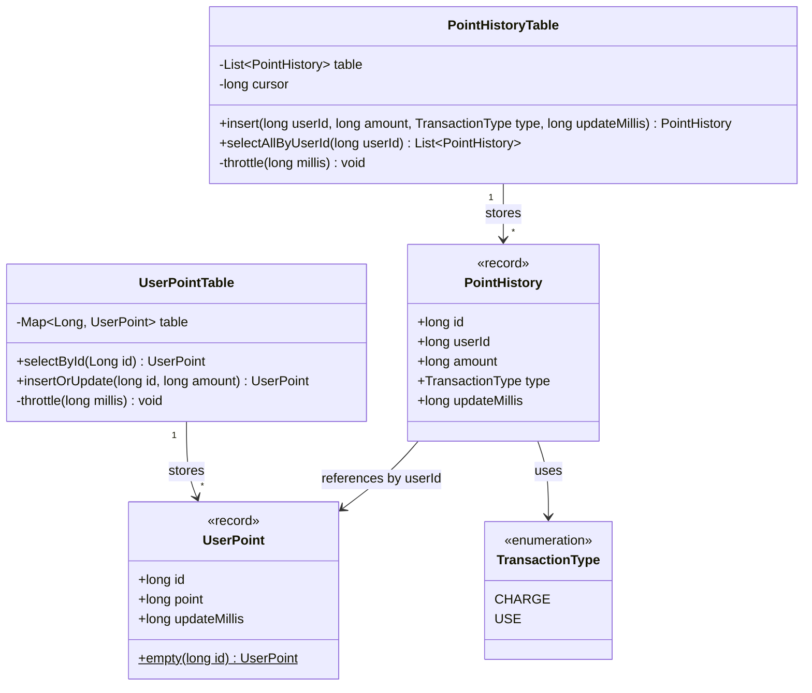
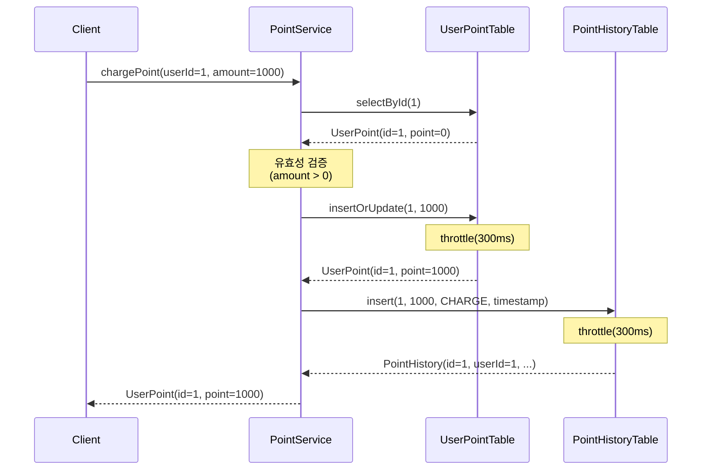
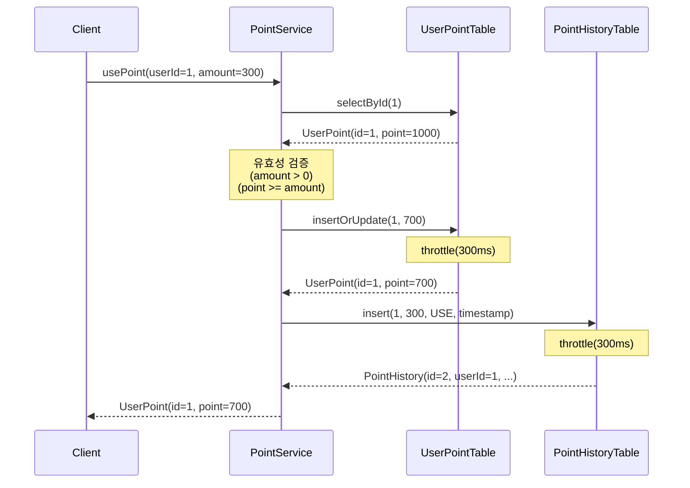
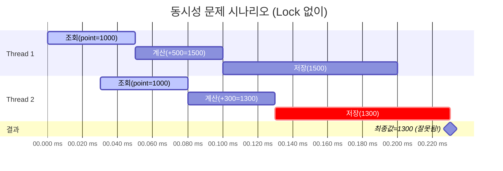

# 포인트 관리 시스템 (TDD)

## 목차
- [AI를 활용한 분석](#ai를-활용한-분석)
  - [1. ER Diagram (테이블 관계도)](#1-er-diagram-테이블-관계도)
  - [2. Class Diagram (클래스 구조)](#2-class-diagram-클래스-구조)
  - [3. Sequence Diagram (포인트 충전 플로우)](#3-sequence-diagram-포인트-충전-플로우)
  - [4. Sequence Diagram (포인트 사용 플로우)](#4-sequence-diagram-포인트-사용-플로우)
  - [5. State Diagram (포인트 상태 변화)](#5-state-diagram-포인트-상태-변화)
  - [6. Flowchart (동시성 제어 흐름)](#6-flowchart-동시성-제어-흐름)
  - [7. Timeline Diagram (동시 요청 시나리오)](#7-timeline-diagram-동시-요청-시나리오)

---

## AI를 활용한 분석
### 1. ER Diagram (테이블 관계도)

### 2. Class Diagram (클래스 구조)

### 3. Sequence Diagram (포인트 충전 플로우)

### 4. Sequence Diagram (포인트 사용 플로우)

### 5. State Diagram (포인트 상태 변화)

### 6. Flowchart (동시성 제어 흐름)

### 7. Timeline Diagram (동시 요청 시나리오)
