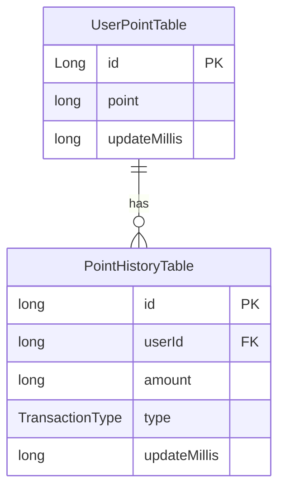
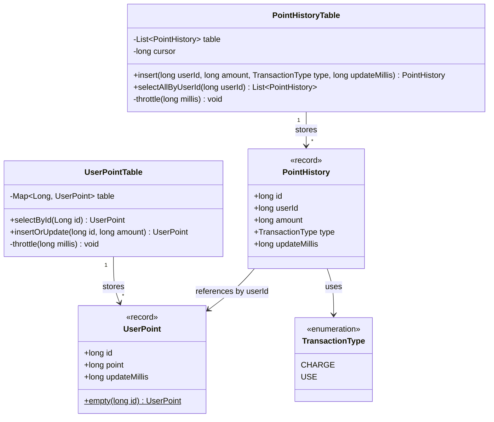
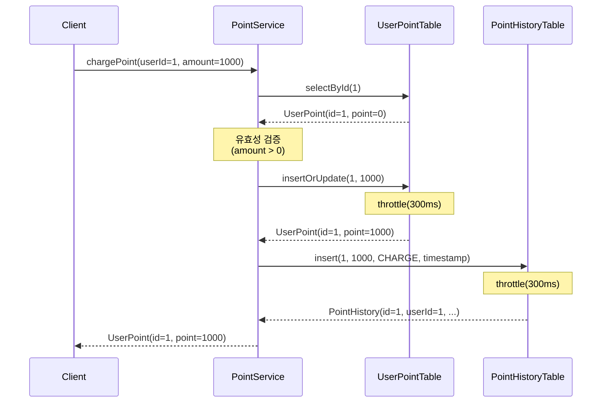
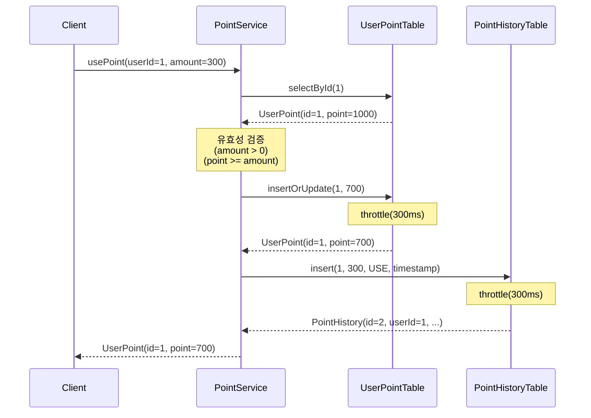
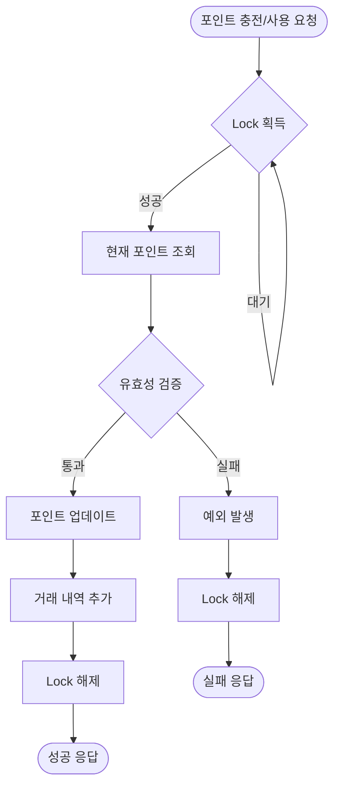
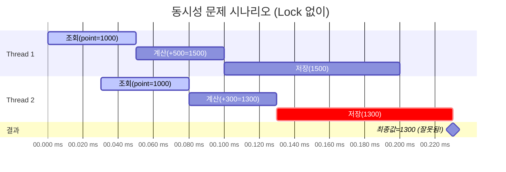

# 포인트 관리 시스템 (TDD)

## 목차
- [프로젝트 개요](#프로젝트-개요)
- [TDD를 적용한 개발 과정](#tdd를-적용한-개발-과정)
  - [1. 포인트 충전 기능 (Red-Green-Refactor)](#1-포인트-충전-기능-red-green-refactor)
  - [2. 포인트 사용 기능](#2-포인트-사용-기능)
  - [3. 동시성 제어](#3-동시성-제어)
- [동시성 제어 방식](#동시성-제어-방식)
  - [선택한 방식: synchronized + ConcurrentHashMap](#선택한-방식-synchronized--concurrenthashmap)
  - [구현 상세](#구현-상세)
  - [장단점 분석](#장단점-분석)
  - [다른 동시성 제어 방식과의 비교](#다른-동시성-제어-방식과의-비교)
- [AI를 활용한 분석](#ai를-활용한-분석)
  - [1. ER Diagram (테이블 관계도)](#1-er-diagram-테이블-관계도)
  - [2. Class Diagram (클래스 구조)](#2-class-diagram-클래스-구조)
  - [3. Sequence Diagram (포인트 충전 플로우)](#3-sequence-diagram-포인트-충전-플로우)
  - [4. Sequence Diagram (포인트 사용 플로우)](#4-sequence-diagram-포인트-사용-플로우)
  - [5. State Diagram (포인트 상태 변화)](#5-state-diagram-포인트-상태-변화)
  - [6. Flowchart (동시성 제어 흐름)](#6-flowchart-동시성-제어-흐름)
  - [7. Timeline Diagram (동시 요청 시나리오)](#7-timeline-diagram-동시-요청-시나리오)

---

## 프로젝트 개요
이 프로젝트는 TDD(Test-Driven Development) 방법론을 적용하여 포인트 관리 시스템을 구현한 과제입니다.
사용자의 포인트 충전, 사용, 조회 기능을 제공하며, 동시성 제어를 통해 여러 스레드가 동시에 포인트를 조작하는 상황에서도 데이터 일관성을 보장합니다.

### 주요 기능
- **포인트 충전**: 1000원 단위로 포인트 충전
- **포인트 사용**: 100원 단위로 포인트 사용 (잔액 검증)
- **포인트 조회**: 특정 사용자의 현재 포인트 조회
- **거래 내역 조회**: 포인트 충전/사용 내역 조회
- **동시성 제어**: 동시 요청 시 데이터 일관성 보장

---

## TDD를 적용한 개발 과정

### 1. 포인트 충전 기능 (Red-Green-Refactor)

#### Red: 실패하는 테스트 작성
```java
@Test
@DisplayName("포인트 충전 - 성공")
void chargePoint_Success() {
    // given
    long userId = 1L;
    long chargeAmount = 1000L;
    long currentPoint = 1000L;
    long newPoint = chargeAmount + currentPoint;

    UserPoint current = new UserPoint(userId, currentPoint, System.currentTimeMillis());
    UserPoint charged = new UserPoint(userId, newPoint, System.currentTimeMillis());

    when(userPointTable.selectById(userId)).thenReturn(current);
    when(userPointTable.insertOrUpdate(userId, newPoint)).thenReturn(charged);

    // when
    UserPoint result = pointService.chargePoint(userId, chargeAmount);

    // then
    assertThat(result).isNotNull();
    assertThat(result.point()).isEqualTo(newPoint);
}
```
**커밋**: `c36cc66` - test: 포인트 충전 기능 테스트 작성 (Red)

#### Green: 테스트를 통과하는 최소한의 코드 작성
```java
public UserPoint chargePoint(long userId, long amount) {
    validateAmount(amount, PointPolicy.CHARGE_UNIT, TransactionType.CHARGE.label());

    UserPoint current = userPointTable.selectById(userId);
    UserPoint updated = userPointTable.insertOrUpdate(userId, current.point() + amount);
    pointHistoryTable.insert(userId, amount, TransactionType.CHARGE, updated.updateMillis());
    return updated;
}
```
**커밋**: `80c4e2f` - feat: 포인트 충전 기능 구현 (Green)

#### 예외 케이스 테스트 추가
```java
@Test
@DisplayName("포인트 충전 - 실패: 0원 충전")
void chargePoint_Fail_ZeroAmount() {
    assertThatThrownBy(() -> pointService.chargePoint(1L, 0L))
        .isInstanceOf(IllegalArgumentException.class)
        .hasMessage("충전 금액은 0보다 커야합니다.");
}

@Test
@DisplayName("포인트 충전 - 실패: 단위 틀림(1000원)")
void chargePoint_Fail_InvalidUnit() {
    assertThatThrownBy(() -> pointService.chargePoint(1L, 100L))
        .isInstanceOf(IllegalArgumentException.class)
        .hasMessage("충전은 1000원 단위로만 가능합니다.");
}
```
**커밋**: `b5ab9e2` - test: 포인트 충전 예외 케이스 테스트 구현 (Green)

#### Refactor: 코드 개선
```java
// 공통 검증 로직 추출
private void validateAmount(long amount, int unit, String type) {
    if (amount <= 0) {
        throw new IllegalArgumentException(type + " 금액은 0보다 커야합니다.");
    }
    if (amount % unit != 0) {
        throw new IllegalArgumentException(
            String.format("%s은 %d원 단위로만 가능합니다.", type, unit)
        );
    }
}
```
**커밋**: `5900a17` - feat: 포인트 충전/사용 기능 리팩토링 (Refactor)

### 2. 포인트 사용 기능
동일한 Red-Green-Refactor 사이클을 적용하여 구현
- **커밋**: `7bdbaab` - test: 포인트 사용 기능 테스트 작성 (Red)
- **커밋**: `6efa2ef` - test: 포인트 사용 예외 케이스 테스트 작성 (Red)
- **커밋**: (Green 단계에서 구현)

### 3. 동시성 제어

#### Red: 동시성 테스트 작성
```java
@Test
@DisplayName("동시에 여러 스레드가 포인트 충전 - 모든 충전이 반영되어야 함")
void chargePoint_ConcurrentRequests() throws InterruptedException {
    long userId = 1L;
    int threadCount = 10;
    long chargeAmount = 1000L;
    ExecutorService executorService = Executors.newFixedThreadPool(threadCount);
    CountDownLatch latch = new CountDownLatch(threadCount);

    for(int i = 0; i < threadCount; i++) {
        executorService.execute(() -> {
            try {
                pointService.chargePoint(userId, chargeAmount);
            } finally {
                latch.countDown();
            }
        });
    }

    latch.await();

    UserPoint result = pointService.getUserPoint(userId);
    assertThat(result.point()).isEqualTo(10000L); // 1000 * 10
}
```
**커밋**: `b04daa1` - test: 동시성 제어 테스트 작성 (Red)

#### Green: synchronized를 이용한 동시성 제어 구현
```java
private final Map<Long, Object> userLocks = new ConcurrentHashMap<>();

public UserPoint chargePoint(long userId, long amount) {
    validateAmount(amount, PointPolicy.CHARGE_UNIT, TransactionType.CHARGE.label());

    Object lock = userLocks.computeIfAbsent(userId, k -> new Object());
    synchronized (lock) {
        UserPoint current = userPointTable.selectById(userId);
        UserPoint updated = userPointTable.insertOrUpdate(userId, current.point() + amount);
        pointHistoryTable.insert(userId, amount, TransactionType.CHARGE, updated.updateMillis());
        return updated;
    }
}
```
**커밋**: `f4b3d1f` - feat: 포인트 충전 동시성 제어 구현 (Green)

---

## 동시성 제어 방식

### 선택한 방식: synchronized + ConcurrentHashMap

이 프로젝트에서는 **Java의 `synchronized` 키워드와 `ConcurrentHashMap`을 결합한 userId 기반 락(Lock) 방식**을 선택했습니다.

### 구현 상세

```java
@Service
@AllArgsConstructor
public class PointService {
    private final UserPointTable userPointTable;
    private final PointHistoryTable pointHistoryTable;

    // 각 유저별로 락 객체 관리
    private final Map<Long, Object> userLocks = new ConcurrentHashMap<>();

    public UserPoint chargePoint(long userId, long amount) {
        validateAmount(amount, PointPolicy.CHARGE_UNIT, TransactionType.CHARGE.label());

        // userId별 락 객체 가져오기 (없으면 생성)
        Object lock = userLocks.computeIfAbsent(userId, k -> new Object());

        // 해당 userId의 락을 획득한 스레드만 실행
        synchronized (lock) {
            UserPoint current = userPointTable.selectById(userId);
            UserPoint updated = userPointTable.insertOrUpdate(userId, current.point() + amount);
            pointHistoryTable.insert(userId, amount, TransactionType.CHARGE, updated.updateMillis());
            return updated;
        }
    }
}
```

#### 핵심 메커니즘
1. **ConcurrentHashMap**: 여러 스레드가 동시에 접근해도 안전한 Map 자료구조
2. **computeIfAbsent()**: userId에 해당하는 락 객체가 없으면 원자적으로 생성하고 반환
3. **synchronized (lock)**: 같은 userId를 가진 요청들은 동일한 락 객체를 공유하여 순차적으로 실행
4. **userId별 분리**: 다른 userId는 다른 락 객체를 사용하므로 동시 실행 가능

#### 동작 예시
```
[Thread 1] userId=1 충전 요청 → lock1 획득 → 처리 중...
[Thread 2] userId=1 사용 요청 → lock1 대기 ⏸
[Thread 3] userId=2 충전 요청 → lock2 획득 → 처리 중... ✅ (동시 실행)
[Thread 1] 처리 완료 → lock1 해제
[Thread 2] lock1 획득 → 처리 시작
```

### 장단점 분석

#### ✅ 장점

1. **구현 간단성**
   - Java 기본 기능만 사용하여 외부 라이브러리 불필요
   - synchronized 키워드로 간결하게 구현
   - 코드 가독성이 높고 유지보수 용이

2. **세밀한 락 제어 (Fine-grained Locking)**
   - userId 단위로 락을 분리하여 병렬 처리 성능 향상
   - 다른 사용자의 요청은 동시에 처리 가능
   - 전역 락(Global Lock) 방식보다 처리량(Throughput) 증가

3. **메모리 효율성**
   - 실제 요청이 발생한 userId에 대해서만 락 객체 생성
   - computeIfAbsent()로 불필요한 객체 생성 방지

4. **데드락 가능성 낮음**
   - 단일 락만 획득하므로 데드락 발생 가능성 최소화
   - 락 획득 순서 문제 없음

5. **자동 락 해제**
   - synchronized 블록을 벗어나면 자동으로 락 해제
   - 예외 발생 시에도 안전하게 락 해제 보장

#### ❌ 단점

1. **메모리 누수 가능성**
   - 한 번 생성된 락 객체는 제거되지 않음
   - 사용자 수가 매우 많을 경우 메모리 사용량 증가
   - **개선 방안**: WeakHashMap 사용 또는 주기적인 락 객체 정리

2. **분산 환경 미지원**
   - 단일 JVM 내에서만 동작
   - 멀티 서버 환경에서는 동시성 제어 불가능
   - **개선 방안**: Redis 등 분산 락(Distributed Lock) 필요

3. **블로킹(Blocking) 방식**
   - 락을 획득할 때까지 스레드가 대기 (BLOCKED 상태)
   - 많은 스레드가 대기할 경우 스레드 풀 고갈 가능
   - **개선 방안**: ReentrantLock의 tryLock() 등 Non-blocking 방식 고려

4. **락 공정성(Fairness) 미보장**
   - synchronized는 락 대기 순서를 보장하지 않음
   - 오래 대기한 스레드가 계속 대기할 수 있음 (Starvation)
   - **개선 방안**: ReentrantLock(true)로 공정성 보장 가능

5. **타임아웃 미지원**
   - 락 획득에 실패하면 무한 대기
   - 데드락 발생 시 영구 대기 가능
   - **개선 방안**: ReentrantLock의 tryLock(timeout) 사용

### 다른 동시성 제어 방식과의 비교

| 방식 | 장점 | 단점 | 적합한 상황 |
|------|------|------|------------|
| **synchronized (현재 방식)** | 간단한 구현, 자동 락 해제 | 타임아웃 불가, 공정성 없음 | 단일 서버, 간단한 동시성 제어 |
| **ReentrantLock** | 타임아웃, 공정성 지원 | 수동 락 해제 필요, 복잡도 증가 | 정교한 락 제어가 필요한 경우 |
| **낙관적 락 (Optimistic Lock)** | 락 오버헤드 없음, 읽기 성능 우수 | 충돌 시 재시도 필요, 쓰기 충돌 많으면 비효율 | 읽기가 많고 충돌이 적은 경우 |
| **분산 락 (Redis, Zookeeper)** | 멀티 서버 지원 | 네트워크 의존성, 복잡도 증가 | 분산 환경, MSA 아키텍처 |
| **Database Lock** | 트랜잭션 단위 제어 | DB 부하 증가, 성능 저하 | 데이터 정합성이 최우선인 경우 |

### 선택 이유
이 프로젝트에서는 다음 이유로 **synchronized + ConcurrentHashMap** 방식을 선택했습니다:
- ✅ 단일 서버 환경 (분산 환경 고려 불필요)
- ✅ 구현 간단성과 유지보수성 중요
- ✅ userId 단위 세밀한 락 제어로 성능 확보
- ✅ 프로젝트 규모에 적합한 충분한 동시성 제어

---

## AI를 활용한 분석
### 1. ER Diagram (테이블 관계도)

### 2. Class Diagram (클래스 구조)

### 3. Sequence Diagram (포인트 충전 플로우)

### 4. Sequence Diagram (포인트 사용 플로우)

### 5. State Diagram (포인트 상태 변화)

### 6. Flowchart (동시성 제어 흐름)

### 7. Timeline Diagram (동시 요청 시나리오)
